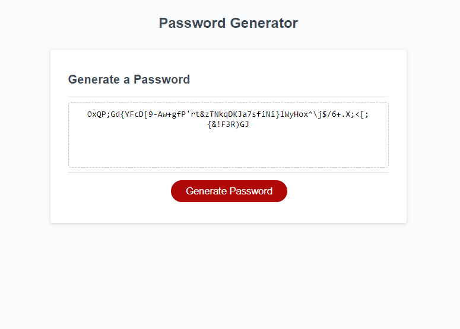

# Random Password Generator

## Description

This is a random password generator made for the KU Bootcamp. You can use this generator to create random passwords that include uppercase letters, lowercase letters, numbers, and special characters.

## Installation

Download file or clone through the Github repository "livschif/password-generator"

## Mock up 

## Links
Link to Github repo:
https://github.com/livschif/password-generator

Link to deployed webpage:
https://livschif.github.io/password-generator/
